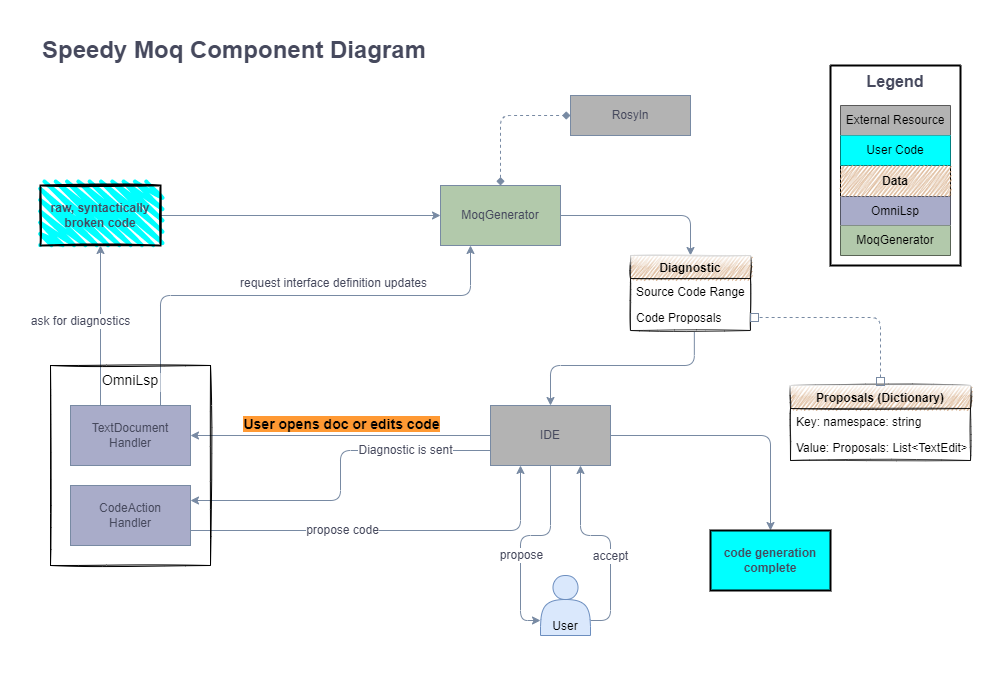
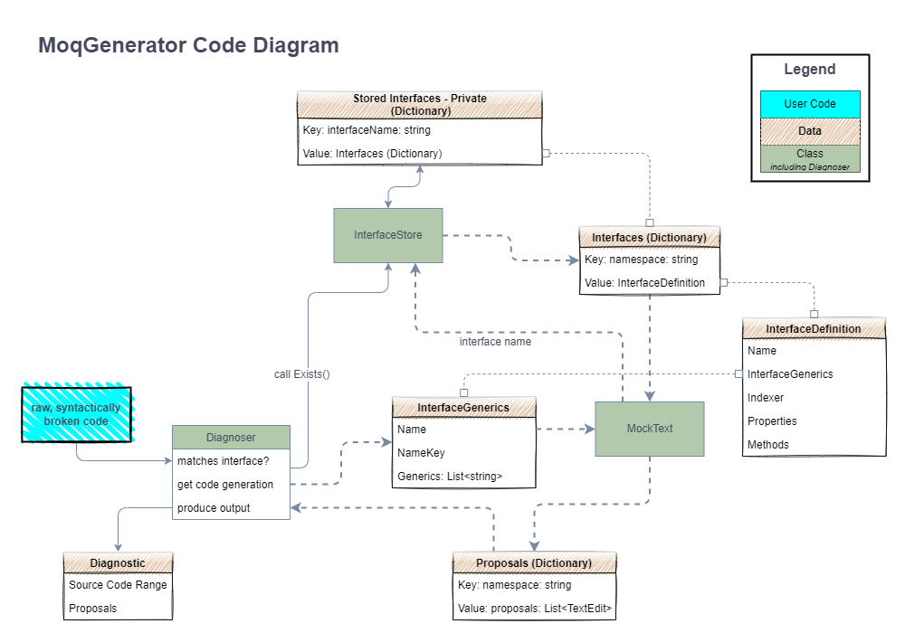

# Architecture

## Table of Contents
- [Architecture](#architecture)
  - [Table of Contents](#table-of-contents)
  - [Context](#context)
  - [Container](#container)
  - [Component](#component)
  - [Code](#code)
- [Diagram workflow](#diagram-workflow)
- [Generating TOC](#generating-toc)

## Context
[^top](#table-of-contents)

## Container
[^top](#table-of-contents)

## Component
[^top](#table-of-contents)

## Code
[^top](#table-of-contents)

# Diagram workflow

[^top](#table-of-contents)

Diagrams are created through diagrams.net (in Google Drive)

By exporting to PNG using the following settings:

the diagrams can be commited to git and later, edited again in diagrams.net by creating a new blank diagram, and using the import feature.

**NOTE: This workflow succeeds most when you do NOT create multi-page diagrams! Create a new diagram for each page. Otherwise, when you download the PNG with the embedded diagram as shown in the image above, the PNG you see is the single page downloaded, but the import will get all other pages from the multi-page diagram, creating an unreliable "source of truth."**

# Generating TOC

[^top](#table-of-contents)

Use [this link](https://imthenachoman.github.io/nGitHubTOC/) to update Table of Contents