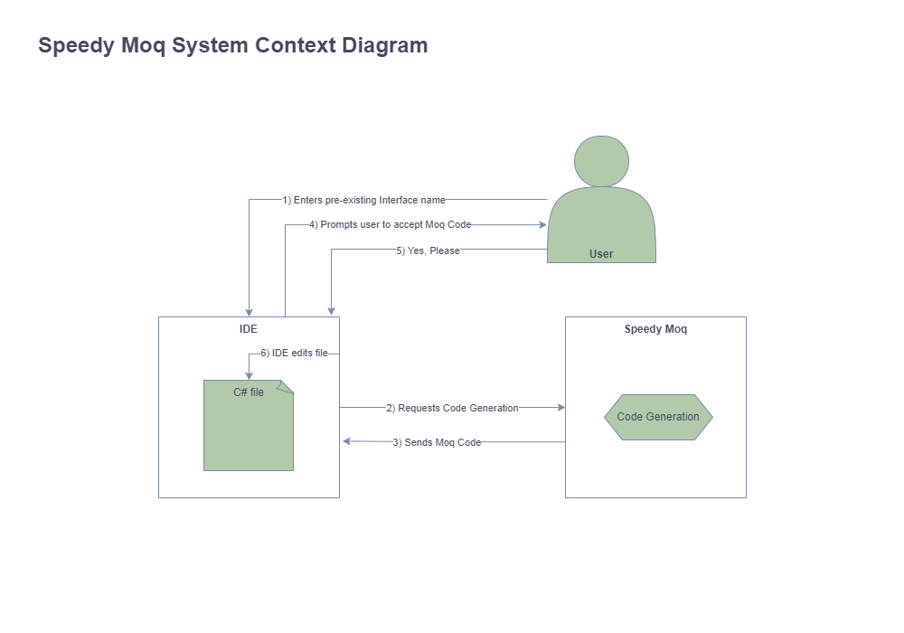
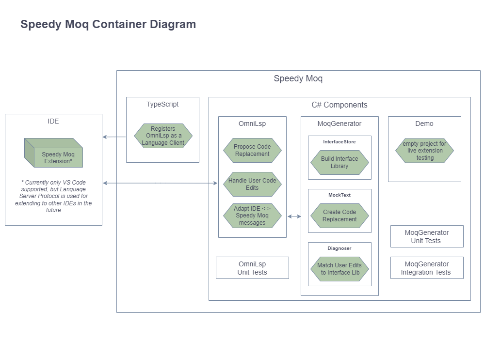
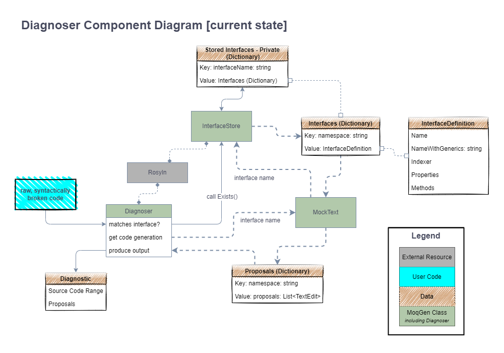
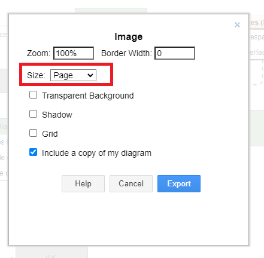

# Architecture

## Table of Contents
- [Architecture](#architecture)
  - [Context](#context)
  - [Container](#container)
  - [Component](#component)
  - [Diagnoser Component - CURRENT STATE](#diagnoser-component---current-state)
- [Diagram workflow](#diagram-workflow)
- [Generating TOC](#generating-toc)

## Context
[^top](#table-of-contents)

## Container
[^top](#table-of-contents)

## Component
[^top](#table-of-contents)

## Diagnoser Component - CURRENT STATE
[^top](#table-of-contents)

# Diagram workflow
[^top](#table-of-contents)

Diagrams are created through diagrams.net (in Google Drive)

By exporting to PNG using the following settings:

the diagrams can be commited to git and later, edited again in diagrams.net by creating a new blank diagram, and using the import feature.

# Generating TOC
[^top](#table-of-contents)

Use [this link](https://imthenachoman.github.io/nGitHubTOC/) to update Table of Contents